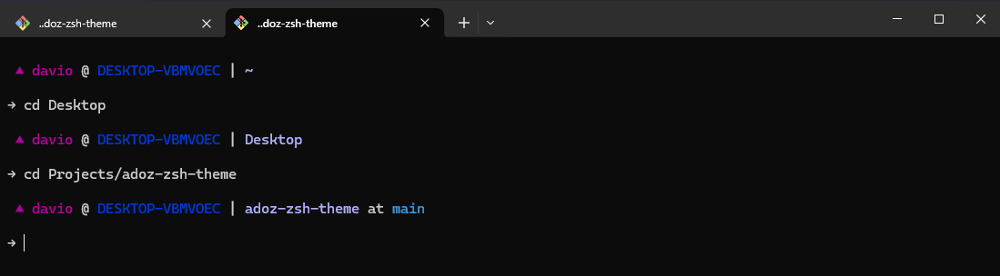
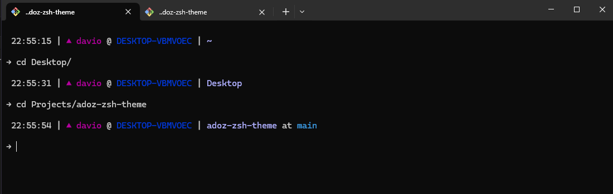

# Adoz ZSH Theme

A minimalistic ZSH theme with a focus on purple and blue color tones. Adoz provides a clean, modern prompt that displays essential information while maintaining a sleek aesthetic.




## Installation

### Step 1: Download the theme

Download the `adoz.zsh-theme` file to your oh-my-zsh themes directory:

```bash
curl -o $ZSH_CUSTOM/themes/adoz.zsh-theme https://raw.githubusercontent.com/daviosoo/adoz-zsh-theme/main/adoz.zsh-theme
```

Or using `wget`:

```bash
wget -O $ZSH_CUSTOM/themes/adoz.zsh-theme https://raw.githubusercontent.com/daviosoo/adoz-zsh-theme/main/adoz.zsh-theme
```

### Step 2: Enable the theme

Edit your `~/.zshrc` file and set the theme:

```bash
ZSH_THEME="adoz"
```

Then reload your ZSH configuration:

```bash
source ~/.zshrc
```

## Configuration

The Adoz theme is highly customizable through environment variables. Add these to your `~/.zshrc` file before the theme is loaded to override the default settings.

### Show/Hide Elements

Control which elements are displayed in your prompt:

```bash
ADOZ_SHOW_TIMESTAMP=false  # Show timestamp (default: false)
ADOZ_SHOW_USER=true  # Show username (default: true)
ADOZ_SHOW_HOSTNAME=true  # Show hostname (default: true)
ADOZ_SHOW_CURRENT_DIR=true  # Show current directory (default: true)
ADOZ_SHOW_GIT=true  # Show git status (default: true)
```

### Colors

Customize the color scheme to match your preferences:

```bash
ADOZ_TIMESTAMP_COLOUR="white"  # Timestamp color (default: white)
ADOZ_USER_COLOUR="magenta"  # Username color (default: magenta)
ADOZ_ROOT_USER_COLOUR="magenta"  # Root user color (default: magenta)
ADOZ_HOSTNAME_COLOUR="blue"  # Hostname color (default: blue)
ADOZ_GIT_COLOUR="cyan"  # Git status color (default: cyan)
```

Available colors: `black`, `red`, `green`, `yellow`, `blue`, `magenta`, `cyan`, `white`

### Timestamp Format

Customize the timestamp format using `strftime` format strings:

```bash
ADOZ_TIMESTAMP_FORMAT="%H:%M:%S"  # Default: %H:%M:%S
```

Examples:

- `%H:%M:%S` - 24-hour time with seconds (14:30:45)
- `%I:%M %p` - 12-hour time with AM/PM (02:30 PM)
- `%Y-%m-%d %H:%M` - Full date and time (2024-01-15 14:30)

### Prompt Symbol

Change the prompt symbol:

```bash
ADOZ_PROMPT="→"  # Default: →
```

## Example Configuration

Here's an example configuration you can add to your `~/.zshrc`:

```bash
# Adoz theme configuration

# Show / Hide elements
ADOZ_SHOW_TIMESTAMP=true

# Update timestamp format
ADOZ_TIMESTAMP_FORMAT="%H:%M"

# Update element colors
ADOZ_TIMESTAMP_COLOUR="cyan"
ADOZ_USER_COLOUR="magenta"
ADOZ_HOSTNAME_COLOUR="blue"
ADOZ_GIT_COLOUR="cyan"
```

## License

See [LICENSE](LICENSE) file for details.
